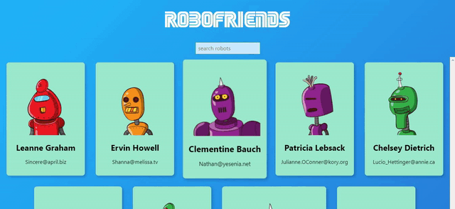

# robofriends
robofriends is a small app that allows you to search for robots made using react.

## Screenshots


## Tools & Languages
  - [tachyons](https://tachyons.io/) library used for design
  - Generated robots api [robohash](https://robohash.org/)
  - Font used in title [SEGA](https://www.cufonfonts.com/font/sega-logo-font)
  - [ReactJs](https://reactjs.org/) javascript framework used
  - [VSCode](https://code.visualstudio.com/) as a text editor

## Usage
```bash
# 1. Clone this repo
git clone https://github.com/oussamabouchikhi/robofriends.git

# 2. Change directory to it
cd robofriends

# 3. Install dependencies
npm install

# 4. Run app
npm start
```

## Contributing
Pull requests are welcome. Feel free to ```fork``` this repo.

## License
This project is open sourced under the [MIT](https://choosealicense.com/licenses/mit/) license.
